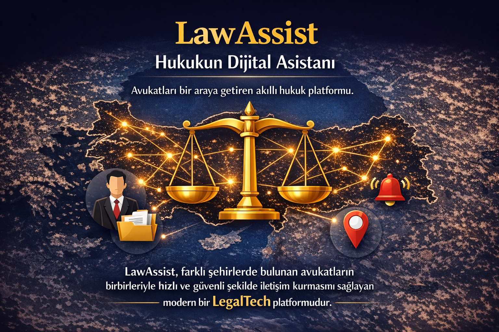

# LawAssist
---

## Proje Hakkında

**Proje Tanımı:** 
> LawAssist isimli hukuk platformumuz, avukatların operasyonel süreçlerini kolaylaştırmak ve mesleki dayanışmayı dijitalleştirmek için tasarlandı. Harita tabanlı yenilikçi tevkil sistemimiz sayesinde meslektaşlarımız Türkiye'nin her yerindeki duruşma ve işlemleri için hızlıca güvenilir destek bulabilirken, modern ve kullanıcı dostu arayüzümüz ile dava dosyalarını tek bir ekrandan rahatça yönetebiliyorlar. Her zaman en yenilikçi teknolojileri avukatlarımıza sunmak için çalışıyoruz ve avukatlarımızın zaman tasarrufu ile bilgi güvenliği bizim için her zaman önceliklidir. Geleceğin hukuk teknolojisi LawAssist'e hoş geldiniz, mesleki süreçlerinize hız ve güç katmak için sabırsızlanıyoruz.

**Proje Kategorisi:** 
> Hukuk Teknolojileri

**Referans Uygulama:** 
> [Örnek Referans Uygulama](https://www.avutap.com.tr/)

---

## Proje Linkleri

- **REST API Adresi:** [api.yazmuh.com](https://api.yazmuh.com)
- **Web Frontend Adresi:** [frontend.yazmuh.com](https://frontend.yazmuh.com)

---

## Proje Ekibi

**Grup Adı:** 
> Leviathan

**Ekip Üyeleri:** 
- Mustafa Enes Koçaslan
- Ahmet Kaan Başkan
- Ünal Şener

---

## Dokümantasyon

Proje dokümantasyonuna aşağıdaki linklerden erişebilirsiniz:

1. [Gereksinim Analizi](Gereksinim-Analizi.md)
2. [REST API Tasarımı](API-Tasarimi.md)
3. [REST API](Rest-API.md)
4. [Web Front-End](WebFrontEnd.md)
5. [Mobil Front-End](MobilFrontEnd.md)
6. [Mobil Backend](MobilBackEnd.md)
7. [Video Sunum](Sunum.md)

